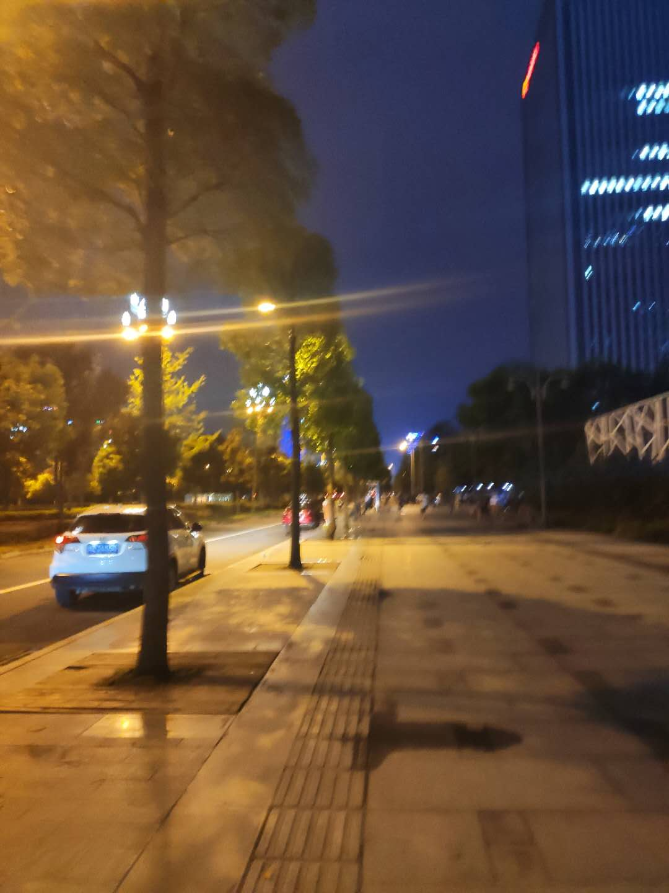
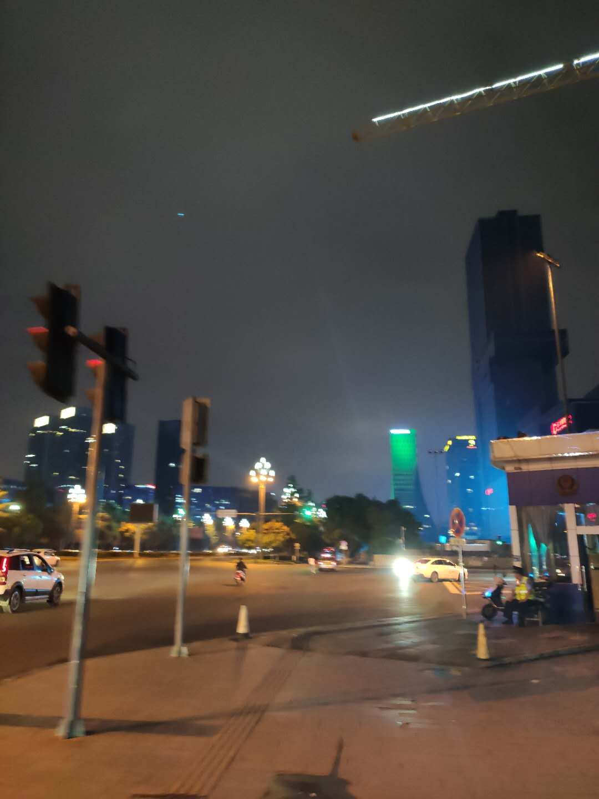

# running-cities
Running in different cities, towns, villages around the world :)

## The origin of this idea

I am creating this repo from an idea I got once I was running down the street. The idea consists of two major processes.

At the beginning, I am thinking about that as there is no playground nearby, how about let's enjoy running on the street, across the city, so we can feel the city with our feet and all of out organs. And further, it would be very cool to draw all the trajectories I ran by on a big paper, e.g., A5 as when I left the city i can have something meaningful to remind me of the days there. 

Later on, i was running and bicycling toward the north of the city. I read some papers about sensing and different sensors. While I was running across a crossroad an idea suddenly comes to my mind: 

>  I am a sensor!

Moreover, we are, human being, all moving and stationary sensors. We can sense the sound, smell, vision, feeling of objects. The coolest thing is that we can sense the data where physical sensors would fail, that is using our hearts to feel the enviroment, feel the people, feel the condition of an event. Therefore, as i plan to run across the city on different streets, what can i do to make something intereting except excercising and enjoying the moment.

So Finally, it comes to my mind. I am running! So, why not let's score and record the running condition (*comfortable level while running or bicycling*) on different parts of the roads in the city. This is coooool!!! This is also very significant for citizens and travelers to this city. 

- Firstly, people care about their health more and more nowadays and running is one of the best and easiest way to keep healthy. And there are not enough speficic facilities for running. So lots of people actually run on the street.  The score represents the comfortable level of running on a specific part of road and can give people a hint which road is suitable for them to run on. 
- Secondly, the information i sense about the road also could reflect some information or pattern of the enviroment at the specific region. What is the pattern? ehhh, this is waiting to be figured out. :)
- Thirdly, the first and second point i point out above are bullshit. hhh, this is just a record for fun. Because it is objective to score the road, there is very litter usage for scientific purpose. However, with the idea of having fun, maybe there are some leasons can be learned after the accumulation of data. Let's see what we get few months later.

That's it! Have a good morning and good night!

## 1.成都 Chengdu

| from      | to        | TIME     | direction | road_con | light | crowd | noise | Avg  |      |
| :-------- | --------- | -------- | --------- | -------- | ----- | ----- | ----- | ---- | ---- |
| S华阳     | S华府大道 | 21~22:00 | S->N      | 3        | 2     | 2     | 4     | 2.75 |      |
| S华府大道 | S华阳     |          | N->S      | 4        | 2     | 4     | 4     | 3.5  |      |
| S华府     | S天府三街 |          | S->N      | 4        | 3     | 4     | 4     | 3.75 |      |
| S天府三街 | S华府     |          | N->S      | 5        | 3     | 5     | 4     | 4.25 |      |
| S天府三街 | S天府五街 |          | S->N      | 6        | 4     | 6     | 5     | 5.25 |      |
| S天府五街 | S天府三街 |          | N->S      | 6        | 5     | 6     | 5     | 5.5  |      |
|           |           |          |           |          |       |       |       |      |      |
|           |           |          |           |          |       |       |       |      |      |
|           |           |          |           |          |       |       |       |      |      |
|           |           |          |           |          |       |       |       |      |      |
|           |           |          |           |          |       |       |       |      |      |
|           |           |          |           |          |       |       |       |      |      |
|           |           |          |           |          |       |       |       |      |      |
|           |           |          |           |          |       |       |       |      |      |

天府五街：

天府三街:

